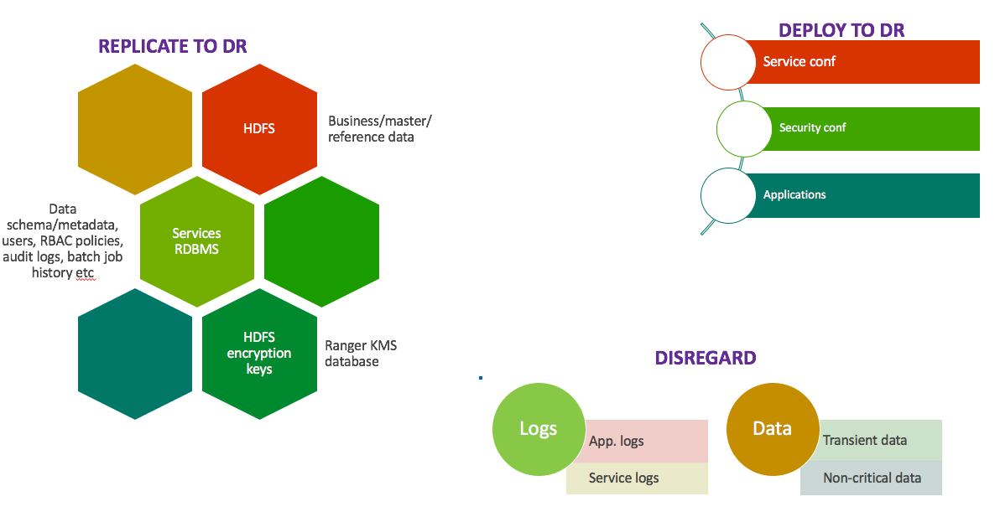
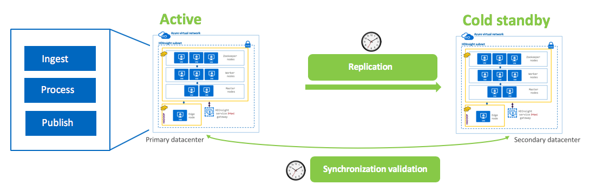
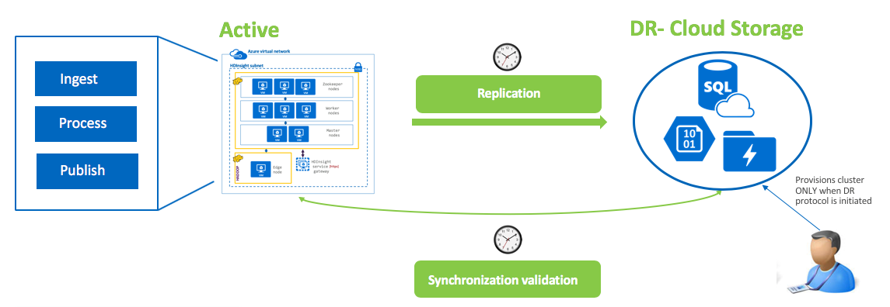
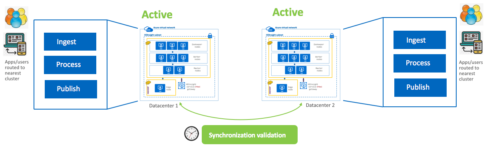
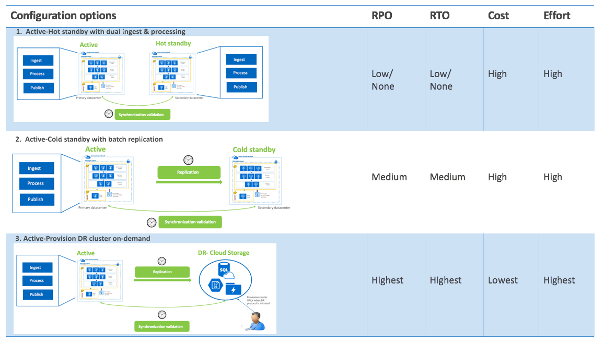
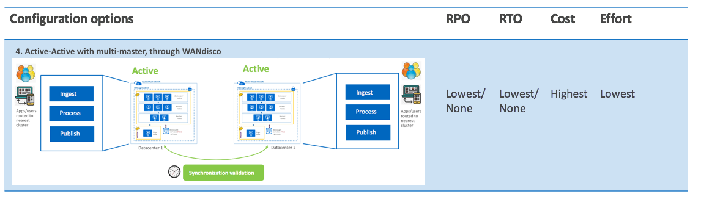

# HDInsight-Spark - High Avaliability and Disaster Recovery

[1. High availability](README.md#1--architectural-considerations-for-high-availability) 
[2. Disaster recovery](DisasterRecovery.md) 
- [2.0.1. What is your SLA for Disaster Recovery?](DisasterRecovery.md#201--what-is-your-sla-for-disaster-recovery)
- [2.0.2. What to replicate?](DisasterRecovery.md#202--what-to-replicate)
- [2.0.3. Replication to DR - options](DisasterRecovery.md#203--replication-to-dr---options)
  - [2.0.3.1. Active - Hot standby with dual ingest and processing](DisasterRecovery.md#2031-active---hot-standby-with-dual-ingest-and-processing)
  - [2.0.3.2. Active - Cold standby with scheduled/batch replication to DR](DisasterRecovery.md#2032-active---cold-standby-with-scheduledbatch-replication-to-dr)
  - [2.0.3.3. Active - DR cluster provisioned on-demand/as needed](DisasterRecovery.md#2033-active---dr-cluster-provisioned-on-demandas-needed)
  - [2.0.3.4. Active - Active with multi-master made possible by WANdisco](DisasterRecovery.md#2034-active---active-with-multi-master-made-possible-by-wandisco)
- [2.0.4. Comparing the options](https://github.com/anagha-microsoft/hdi-spark-dr/blob/master/DisasterRecovery.md#204--comparing-the-options)
- [2.0.5. Replication tooling & considerations, specific to HDInsight](DisasterRecovery.md#205--replication-tooling--considerations-specific-to-hdinsight)
  - [2.0.5.1. Active - Hot standby with dual ingest and processing](DisasterRecovery.md#2031-active---hot-standby-with-dual-ingest-and-processing)

## 2.  Architectural considerations for Disaster Recovery

### FAQ: Azure Blob Storage has geo-redundancy.  Do I really need further consideration?  Wont my data be replication automagically?
Azure Blob Storage offers geographically redundant storage (GRS) and read access geographically redundant storage (RA-GRS).  The storage account has to be configured as GRS/RA-GRS at provision time.   
  
**Consideration:**
- Both options above, replicate storage ONLY, asynchronously to an Azure *paired datacenter*. Need stronger consistency - not a viable option for you.
- ONLY Microsoft can initiate DR, and only in the event of an *entire primary datacenter outage*. If you have a need for failover even if datacenter is not down - its not an option.
- If your DR datacenter is other than an Azure paired datacenter - its not a viable option for you.

**Therefore...**
For most power, control, flexibility, manage your own replication to your DR datacenter.

### 2.0.1.  What is your SLA for Disaster Recovery?
The SLA for disaster recovery can be covered under two popular acronyms - 
[RTO - Recoverty Time Objective](https://en.wikipedia.org/wiki/Recovery_time_objective) 
The targeted duration of time and a service level within which a business process must be restored after a disaster (or disruption) in order to avoid unacceptable consequences associated with a break in business continuity. 
[RPO - Recovery Point Objective](https://en.wikipedia.org/wiki/Recovery_point_objective) 
A recovery point objective (RPO) is defined by business continuity planning. It is the maximum targeted period in which data might be lost from an IT service due to a major incident.  

The RPO and RTO requirements (, and needless to say, your budget) drive the DR architecture for your HDInsight solution.

### 2.0.2.  What to replicate? 

  

### 2.0.3.  Replication to DR - options

#### 2.0.3.1. Active - Hot standby with dual ingest and processing

  
- Applications/integration processes write to both clusters
- Both clusters run identical batch jobs
- Standby cluster is offline for reads by applications and end users
- Synchronization tasks need to be run to ensure clusters are in sync
- RPO => Low/None | RTO => Low/None | Cost => High

#### 2.0.3.2. Active - Cold standby with scheduled/batch replication to DR

  
- Applications write to active-primary ONLY
- Replication to DR cluster is incremental, batch, scheduled
- Synchronization tasks need to be run to ensure clusters are in sync
- Only curated data is copied over, no processing jobs are run
- Its is not uncommon to have a storage dense, compute light DR cluster for cost optimization
- RPO => Medium | RTO => Medium | Cost => High

#### 2.0.3.3. Active - DR cluster provisioned on-demand/as needed

  
- Applications write to active-primary cluster, no DR cluster provisioned
- Replication utilities synchronize data and metastore to cloud storage in DR datacenter
- Administrator provisions cluster on-demand in DR datacenter
- Synchronization tasks need to be run to ensure clusters are in sync
 - RPO => Highest | RTO => Highest | Cost => Lowest

#### 2.0.3.4. Active - Active with multi-master made possible by WANdisco

  
- Applications/integration processes write to/read from nearest cluster clusters
- Both clusters run identical batch jobs
- Synchronization tasks need to be run to ensure clusters are in sync
- WANdisco fusion supports automated metadata replication (sync) and data replication (async), scheduling, monitoring, alerting, bandwidth throttling and more
 - RPO => Lowest/None | RTO => Lowest/None | Cost => Highest | Effort => Lowest

### 2.0.4.  Comparing the options

  

### 2.0.5.  Replication tooling & considerations, specific to HDInsight
#### 2.0.5.1.  Storage
- distcp: Hadoop native replication utility
- WANdisco fusion: ISV; Automated asynchronous replication
- Azure Data Factory v2: Create a scheduled workflow to leverage distcp to replicate data from primary cluster to secondary datacenter; [Documentation for ADF for distcp](https://docs.microsoft.com/en-us/azure/data-factory/connector-hdfs#use-distcp-to-copy-data-from-hdfs)

#### 2.0.5.2.  Metadata
- WANdisco fusion: ISV; Automated synchronous replication
- Azure Data Factory v2: Create a scheduled workflow to leverage ADFv2 SQL database connector to selectively replicate metadata from primary datacenter metastore RDBMS to secondary datacenter metastore RDBMS;  [Documentation for ADF for SQL database replication](https://docs.microsoft.com/en-us/azure/data-factory/connector-azure-sql-database)

**Considerations with ADFv2:** 
- Remember to replace the location in table DDL appropriately to match secondary datacenter location
- Run msck repair table to fix partitions

