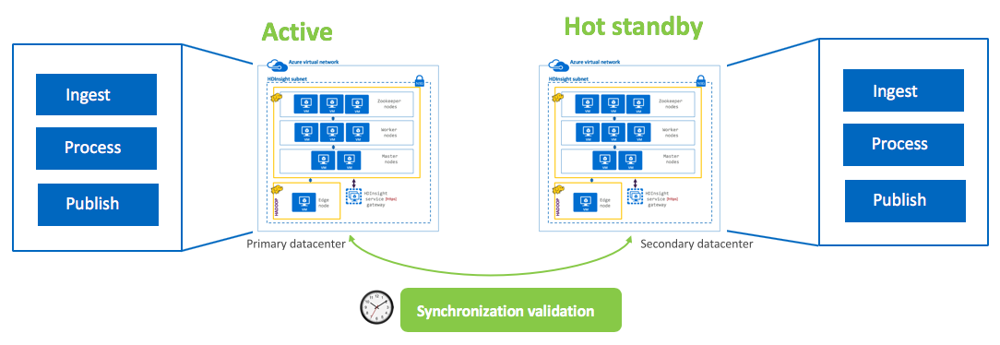

# HDInsight-Spark - High Avaliability and Disaster Recovery

[1. High availability](README.md#1--architectural-considerations-for-high-availability) 
[2. Disaster recovery](DisasterRecovery.md) 
- [2.0.1. What is your SLA for Disaster Recovery?](DisasterRecovery.md#201--what-is-your-sla-for-disaster-recovery)
- [2.0.2. What to replicate?](DisasterRecovery.md#202--what-to-replicate)
- [2.0.3. Replication to DR - options](DisasterRecovery.md#203--replication-to-dr---options)
  - [2.0.3.1. Active - Hot standby with dual ingest and processing]()
  - [2.0.3.2. Active - Cold standby with scheduled/batch replication to DR]()
  - [2.0.3.3. Active - DR cluster provisioned on-demand/as needed]()
  - [2.0.3.4. Active - Active with multi-master made possible by WANdisco]()

## 2.  Architectural considerations for Disaster Recovery

### 2.0.1.  What is your SLA for Disaster Recovery?
The SLA for disaster recovery can be covered under two popular acronyms - 
[RTO - Recoverty Time Objective](https://en.wikipedia.org/wiki/Recovery_time_objective) 
The targeted duration of time and a service level within which a business process must be restored after a disaster (or disruption) in order to avoid unacceptable consequences associated with a break in business continuity. 
[RPO - Recovery Point Objective](https://en.wikipedia.org/wiki/Recovery_point_objective) 
A recovery point objective (RPO) is defined by business continuity planning. It is the maximum targeted period in which data might be lost from an IT service due to a major incident.  

The RPO and RTO requirements (, and needless to say, your budget) drive the DR architecture for your HDInsight solution.

### 2.0.2.  What to replicate? 

  

### 2.0.3.  Replication to DR - options

#### 2.0.3.1. Active - Hot standby with dual ingest and processing

  
- Applications/integration processes write to both clusters
- Both clusters run identical batch jobs
- Standby cluster is offline for reads by applications and end users
- Synchronization tasks need to be run to ensure clusters are in sync
- RPO => Low/None | RTO => None | Cost => High

#### 2.0.3.2. Active - Cold standby with scheduled/batch replication to DR

  
- Applications write to active-primary ONLY
- Replication to DR cluster is incremental, batch, scheduled
- Synchronization tasks need to be run to ensure clusters are in sync
- Its is not uncommon to have a storage dense, compute light DR cluster for cost optimization
- RPO => Medium | RTO => Medium | Cost => High

#### 2.0.3.3. Active - DR cluster provisioned on-demand/as needed

  
- Applications write to active-primary cluster, no DR cluster provisioned
- Replication utilities synchronize data and metastore to cloud storage in DR datacenter
- Administrator provisions cluster on-demand in DR datacenter
- Synchronization tasks need to be run to ensure clusters are in sync
 - RPO => Highest | RTO => Highest | Cost => Lowest

#### 2.0.3.4. Active - Active with multi-master made possible by WANdisco

  
- Applications/integration processes write to/read from nearest cluster clusters
- Both clusters run identical batch jobs
- Synchronization tasks need to be run to ensure clusters are in sync
- WANdisco fusion supports automated metadata replication (sync) and data replication (async), scheduling, monitoring, alerting, bandwidth throttling and more
 - RPO => Lowest | RTO => Lowest | Cost => Highest | Effort => Lowest

