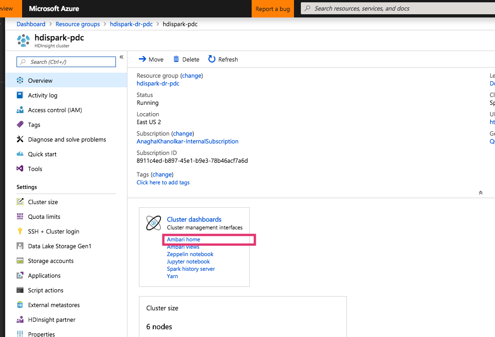

# HDInsight-Spark: Replication to DR datacenter on Azure with distcp - by example

This sample covers DR for HDInsight Spark leveraging distcp. 
In this example, we will provision HDInsight Spark and dependencies in US East 2 (primary) and US West 2 (secondary).  The following are steps to deploy and configure replication to DR. 

## 1.  Primary datacenter - USEast2 - setup

### 1.0.1. Provision resource group in USEast2
Create a resource group. 

  

### 1.0.2. Provision a virtual network in the resource group

  

  

  

  

  

  

  

### 1.0.3. Provision HDInsight Spark in the resource group to use the Vnet

  

  

  

  

  

  

  

  

### 1.0.3. Connect to the HDInsight Spark cluster - Ambari cluster manager

  

  

  

  

### 1.0.4. Connect to the HDInsight Spark cluster - via SSH

  

  

  

## 2.  Secondary datacenter - USWest2 - setup

Repeat the same steps in the secondary datacenter. 
2.1. Create a resource group 
2.2. Within the resource group, provision  virtual network with **address range that does not overlap with the virtual network in the primary datacenter** 
2.3. Within the resource group, provision  HDInsight Spark within the virtual network created in 2.2

## 3.  Global Vnet peering

We will now peer the virtual networks of the primary and secondary datacenters.
### 3.0.1. Peer the primary datacenter's vnet to the secondary datacenter's

  

  

  

  

  

### 3.0.2. Peer the secondary datacenter's vnet to the primary datacenter's

  

  

  

  

  

  

## 4.  Attach storage accounts for data to each custer

### 4.1. Create storage account and attach to primary cluster

##### 4.1.1. Create storage account

  

  

##### 4.1.2. Attach to the cluster

  

  

  

## 5.  Execute distcp

## 6. Validate replication

## 7. Other considerations

