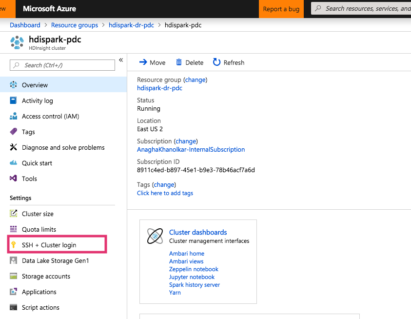
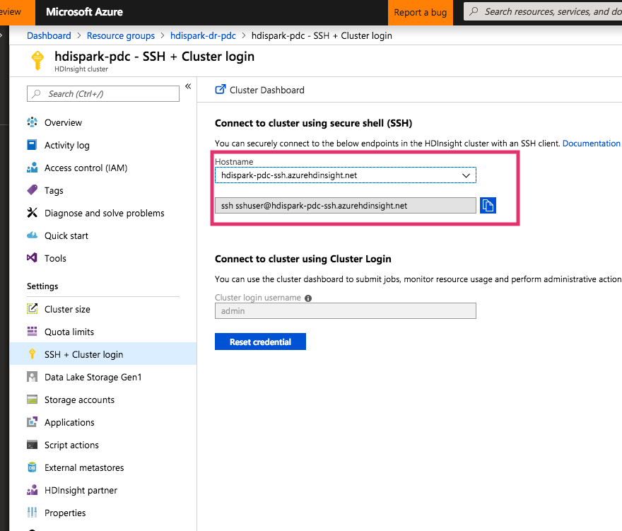
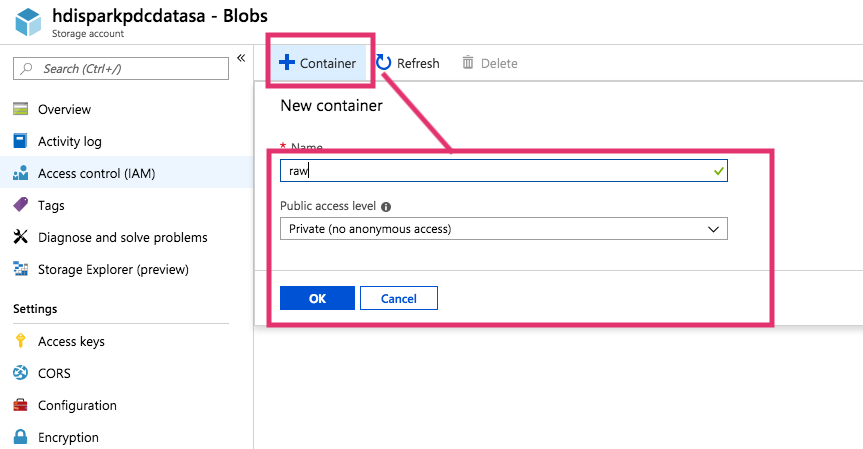

# HDInsight-Spark: Replication to DR datacenter on Azure with distcp - by example

This sample covers DR for HDInsight Spark leveraging distcp.  In this example, we will provision HDInsight Spark and dependencies in US East 2 (primary) and US West 2 (secondary).  The following are steps to deploy and configure replication to DR.<br>

**Table of contents**<br>
[1.  Primary datacenter - USEast2 - setup](https://github.com/anagha-microsoft/hdi-spark-dr/blob/master/README.md#1--primary-datacenter---useast2---setup)<br>
- [1.0.1. Provision resource group in USEast2](https://github.com/anagha-microsoft/hdi-spark-dr/blob/master/README.md#101-provision-resource-group-in-useast2)<br>
- [1.0.2. Provision a virtual network in the resource group](README.md#101-provision-resource-group-in-useast2)<br>
- [1.0.3. Provision HDInsight Spark in the resource group to use the Vnet](README.md#103-provision-hdinsight-spark-in-the-resource-group-to-use-the-vnet)<br>
- [1.0.4. Connect to the HDInsight Spark cluster - Ambari cluster manager](README.md#104-connect-to-the-hdinsight-spark-cluster---ambari-cluster-manager)<br>
- [1.0.5. Connect to the HDInsight Spark cluster - via SSH](README.md#105-connect-to-the-hdinsight-spark-cluster---via-ssh)

[2.  Secondary datacenter - USWest2 - setup](README.md#2--secondary-datacenter---uswest2---setup)<br>

## 1.  Primary datacenter - USEast2 - setup

### 1.0.1. Provision resource group in USEast2
Create a resource group.<br>

<br><br>

### 1.0.2. Provision a virtual network in the resource group

<br><br>
<hr>


<br><br>
<hr>


<br><br>
<hr>


<br><br>
<hr>


<br><br>
<hr>


<br><br>
<hr>


<br><br>
<hr>


### 1.0.3. Provision HDInsight Spark in the resource group to use the Vnet

<br><br>
<hr>


<br><br>
<hr>


<br><br>
<hr>


<br><br>
<hr>


<br><br>
<hr>


<br><br>
<hr>


<br><br>
<hr>


<br><br>
<hr>

### 1.0.4. Connect to the HDInsight Spark cluster - Ambari cluster manager

<br><br>
<hr>


<br><br>
<hr>


<br><br>
<hr>


<br><br>
<hr>

### 1.0.5. Connect to the HDInsight Spark cluster - via SSH

<br><br>
<hr>


<br><br>
<hr>


<br><br>
<hr>

## 2.  Secondary datacenter - USWest2 - setup

Repeat the same steps in the secondary datacenter.<br>
2.1. Create a resource group<br>
2.2. Within the resource group, provision  virtual network with **address range that does not overlap with the virtual network in the primary datacenter**<br>
2.3. Within the resource group, provision  HDInsight Spark within the virtual network created in 2.2

## 3.  Global Vnet peering

We will now peer the virtual networks of the primary and secondary datacenters.
### 3.0.1. Peer the primary datacenter's vnet to the secondary datacenter's

<br><br>
<hr>


<br><br>
<hr>


<br><br>
<hr>


<br><br>
<hr>


<br><br>
<hr>

### 3.0.2. Peer the secondary datacenter's vnet to the primary datacenter's


<br><br>
<hr>


<br><br>
<hr>


<br><br>
<hr>


<br><br>
<hr>


<br><br>
<hr>


<br><br>
<hr>

## 4.  Attach storage accounts for data to each custer

### 4.1. Create storage account and attach to primary cluster, test it

##### 4.1.1. Create storage account

<br><br>
<hr>


<br><br>
<hr>

Navigate to your storage account on the portal.  You will need the storage account keys for attaching to the cluster.

<br><br>
<hr>

Capture the account name and key.

<br><br>
<hr>

##### 4.1.2. Attach the storage account to the cluster with a HDInsight script action
Naviate to the cluster on the Azure portal.

<br><br>
<hr>

Click on script action, and submit new.

<br><br>
<hr>

Select the first option for attaching a storage account, and paste the storage account name and key from section 4.1.1, separated by a space and create the script action.

<br><br>
<hr>


<br><br>
<hr>

##### 4.1.3. Create storage containers in the storage account


<br><br>
<hr>


<br><br>
<hr>



<br><br>
<hr>

##### 4.1.4. Test the access to the storage container from HDFS CLI on HDInsight-Spark


1.  List the storage account contents for container "staging".  Replace with your storage account and container name, you should not not see anything returned.
```
hdfs dfs -ls wasbs://staging@hdisparkpdcdatasa.blob.core.windows.net/
```
2.  Create a file in local linux file system
```
echo "Sample file" > sampleFile.txt
```
3. Upload to HDFS
```
hdfs dfs -put sampleFile.txt wasbs://staging@hdisparkpdcdatasa.blob.core.windows.net/
```
4. List
```
hdfs dfs -ls wasbs://staging@hdisparkpdcdatasa.blob.core.windows.net/
```
You shoud see the file returned-
```
Found 1 items
-rw-r--r--   1 sshuser supergroup         12 2018-11-12 19:06 wasbs://staging@hdisparkpdcdatasa.blob.core.windows.net/sampleFile.txt
```

5.  Open the file and view contents (for testing only)
```
hdfs dfs -cat wasbs://staging@hdisparkpdcdatasa.blob.core.windows.net/sampleFile.txt
```
You should see-
```
Sample file
```

This concludes the test for attching the storage account, creating containers and loading a file to HDFS.

### 4.2. Create storage account and attach to secondary cluster, test it
Repeat the steps in 4.1 in the secondary datacenter resource group and cluster.  Once completed, we can test the replication.

## 5.  distcp replication to DR - basics from the command line 
### 5.1. Dependency
The secondary datacenter data storage account needs to be attached to the primary datacenter cluster via a script action.
Follow steps detailed in the earlier sections to attach the secondary datacenter data store account to the primary datacenter HDI cluster.  


### 5.2. Execute distcp - basics
The command:
```
sshuser@hn0-hdispa:~$ hadoop distcp wasbs://staging@hdisparkpdcdatasa.blob.core.windows.net/ wasbs://staging@hdisparksdcdatasa.blob.core.windows.net/
```

Output:
```
18/11/12 22:03:58 INFO tools.DistCp: Input Options: DistCpOptions{atomicCommit=false, syncFolder=false, deleteMissing=false, ignoreFailures=false, overwrite=false, append=false, useDiff=false, fromSnapshot=null, toSnapshot=null, skipCRC=false, blocking=true, numListstatusThreads=0, maxMaps=20, mapBandwidth=100, sslConfigurationFile='null', copyStrategy='uniformsize', preserveStatus=[], preserveRawXattrs=false, atomicWorkPath=null, logPath=null, sourceFileListing=null, sourcePaths=[wasbs://staging@hdisparkpdcdatasa.blob.core.windows.net/], targetPath=wasbs://staging@hdisparksdcdatasa.blob.core.windows.net/, targetPathExists=true, filtersFile='null', verboseLog=false}
18/11/12 22:03:58 INFO client.AHSProxy: Connecting to Application History server at headnodehost/10.9.0.20:10200
18/11/12 22:03:59 INFO tools.SimpleCopyListing: Paths (files+dirs) cnt = 2; dirCnt = 1
18/11/12 22:03:59 INFO tools.SimpleCopyListing: Build file listing completed.
18/11/12 22:03:59 INFO tools.DistCp: Number of paths in the copy list: 2
18/11/12 22:03:59 INFO tools.DistCp: Number of paths in the copy list: 2
18/11/12 22:03:59 INFO client.AHSProxy: Connecting to Application History server at headnodehost/10.9.0.20:10200
18/11/12 22:03:59 INFO client.RequestHedgingRMFailoverProxyProvider: Looking for the active RM in [rm1, rm2]...
18/11/12 22:03:59 INFO client.RequestHedgingRMFailoverProxyProvider: Found active RM [rm2]
18/11/12 22:04:00 INFO mapreduce.JobSubmitter: number of splits:2
18/11/12 22:04:00 INFO mapreduce.JobSubmitter: Submitting tokens for job: job_1542055752025_0005
18/11/12 22:04:00 INFO impl.YarnClientImpl: Submitted application application_1542055752025_0005
18/11/12 22:04:01 INFO mapreduce.Job: The url to track the job: http://hn1-hdispa.rkes4aowty3etktwegqs0cfvtg.cx.internal.cloudapp.net:8088/proxy/application_1542055752025_0005/
18/11/12 22:04:01 INFO tools.DistCp: DistCp job-id: job_1542055752025_0005
18/11/12 22:04:01 INFO mapreduce.Job: Running job: job_1542055752025_0005
18/11/12 22:04:17 INFO mapreduce.Job: Job job_1542055752025_0005 running in uber mode : false
18/11/12 22:04:17 INFO mapreduce.Job:  map 0% reduce 0%
18/11/12 22:04:33 INFO mapreduce.Job:  map 50% reduce 0%
18/11/12 22:04:35 INFO mapreduce.Job:  map 100% reduce 0%
18/11/12 22:04:37 INFO mapreduce.Job: Job job_1542055752025_0005 completed successfully
18/11/12 22:04:37 INFO mapreduce.Job: Counters: 39
	File System Counters
		FILE: Number of bytes read=0
		FILE: Number of bytes written=338704
		FILE: Number of read operations=0
		FILE: Number of large read operations=0
		FILE: Number of write operations=0
		WASB: Number of bytes read=1204
		WASB: Number of bytes written=0
		WASB: Number of read operations=0
		WASB: Number of large read operations=0
		WASB: Number of write operations=0
		WASBS: Number of bytes read=12
		WASBS: Number of bytes written=12
		WASBS: Number of read operations=0
		WASBS: Number of large read operations=0
		WASBS: Number of write operations=0
	Job Counters 
		Launched map tasks=2
		Other local map tasks=2
		Total time spent by all maps in occupied slots (ms)=58588
		Total time spent by all reduces in occupied slots (ms)=0
		Total time spent by all map tasks (ms)=29294
		Total vcore-milliseconds taken by all map tasks=29294
		Total megabyte-milliseconds taken by all map tasks=29997056
	Map-Reduce Framework
		Map input records=2
		Map output records=0
		Input split bytes=260
		Spilled Records=0
		Failed Shuffles=0
		Merged Map outputs=0
		GC time elapsed (ms)=87
		CPU time spent (ms)=3780
		Physical memory (bytes) snapshot=649220096
		Virtual memory (bytes) snapshot=8995217408
		Total committed heap usage (bytes)=5294260224
	File Input Format Counters 
		Bytes Read=814
	File Output Format Counters 
		Bytes Written=0
	org.apache.hadoop.tools.mapred.CopyMapper$Counter
		BYTESCOPIED=12
		BYTESEXPECTED=12
		COPY=1
		DIR_COPY=1
```
### 5.3. Validate replication

On the DR cluster in the secondary datacenter, validate with file listing:
```
hdfs dfs -ls wasbs://staging@hdisparksdcdatasa.blob.core.windows.net/
```

Output:
```
Found 1 items
-rw-r--r--   1 sshuser supergroup         12 2018-11-12 22:04 wasbs://staging@hdisparksdcdatasa.blob.core.windows.net/sampleFile.txt
```

## 7. Other considerations


