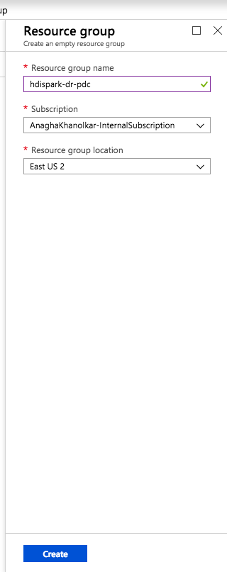

# HDInsight-Spark: Replication to DR datacenter on Azure with distcp - by example

This sample covers DR for HDInsight Spark leveraging distcp. 
In this example, we will provision HDInsight Spark and dependencies in US East 2 (primary) and US West 2 (secondary).  The following are steps to deploy and configure replication to DR. 

## 1.  Primary datacenter - USEast2 - setup

### 1.0.1. Provision resource group in USEast2
Create a resource group. 

  
